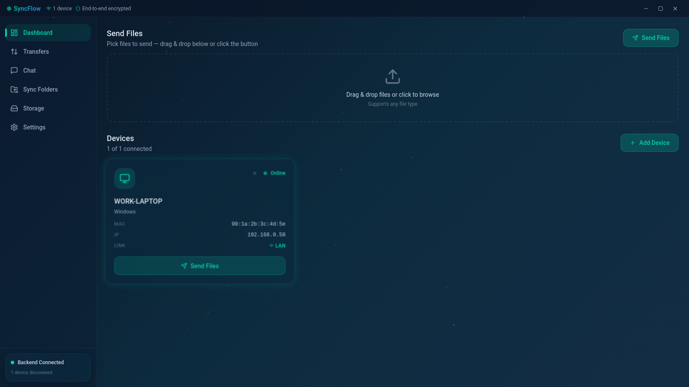
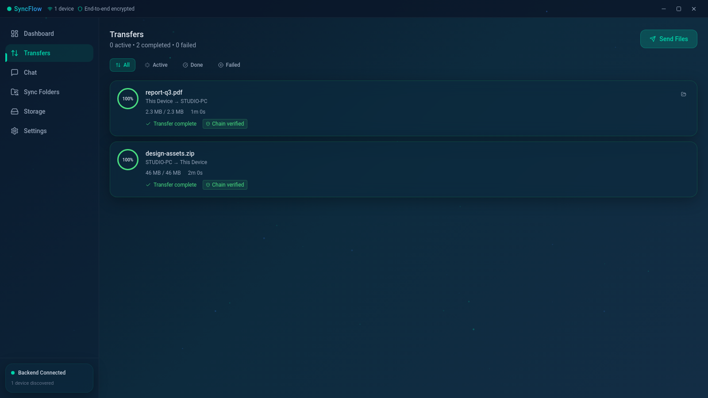
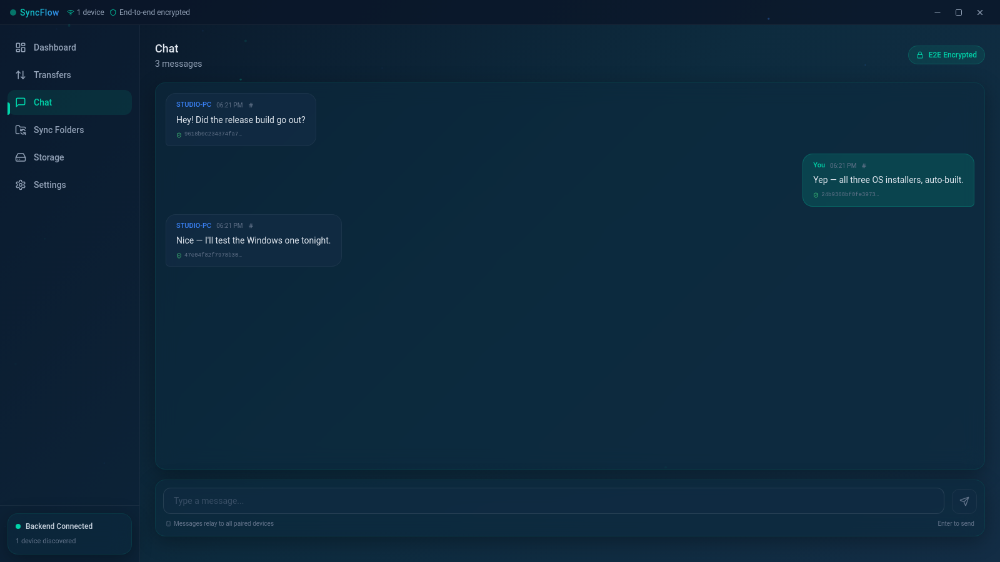
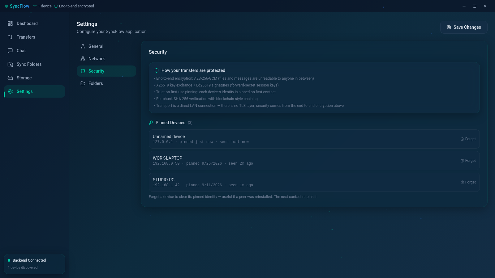
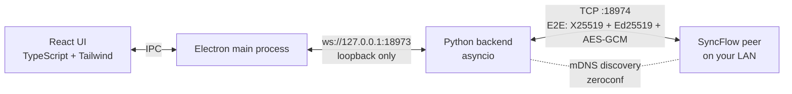

<p align="center">
  
</p>

<h1 align="center">SyncFlow</h1>

<p align="center">
  <b>Your files. Your LAN. Your keys.</b><br>
  Peer-to-peer file transfer, sync folders and end-to-end encrypted chat —<br>
  no cloud, no accounts, no telemetry.
</p>

<p align="center">
  <a href="https://github.com/killerdasher/syncflow/actions/workflows/ci.yml"></a>
  <a href="https://github.com/killerdasher/syncflow/releases"></a>
  <a href="https://github.com/killerdasher/syncflow/releases"></a>
  
  
  <a href="https://github.com/killerdasher/syncflow/attestations"></a>
  <a href="LICENSE"></a>
</p>

<p align="center">
  <a href="https://github.com/killerdasher/syncflow/releases/latest"></a>
  <a href="https://github.com/killerdasher/syncflow/releases/latest"></a>
  <a href="SECURITY_REPORT.md"></a>
  <a href="docs/roadmap.md"></a>
</p>

## Why SyncFlow?

| | |
|---|---|
| **End-to-end encrypted** | X25519 key exchange, Ed25519 signatures, AES-256-GCM payloads — keys never leave your devices. Trust-on-first-use pinning, manageable in Settings, plus a **16-icon SAS check** to verify pairing out-of-band. |
| **Local network only** | No cloud, no accounts, no telemetry. Devices find each other via mDNS; data takes a direct LAN path. |
| **Verified transfers** | Per-chunk SHA-256 with blockchain-style chaining — the UI shows **Chain verified** on arrival. |
| **Sync folders** | Pair a local folder with a device; push new/changed files manually or on an interval (1/5/15 min). |
| **Encrypted chat** | Relay messages between your devices with per-message hash badges; history persists locally. |
| **Open & reproducible** | MIT-licensed, CI-built on Linux/Windows/macOS, every release carries SHA-256 sums and build-provenance attestations. |

## Screenshots

<p align="center">
  
</p>
<p align="center">
  
  
  
</p>

## Download

Grab the latest build for your OS from the **[Releases](https://github.com/killerdasher/syncflow/releases/latest)** page:

| OS | Artifact | Shortcut after install |
|----|----------|------------------------|
| **Linux** | `SyncFlow-x.y.z.AppImage` · `.deb` · `.rpm` | deb/rpm: app menu ready · AppImage: run [`install-appimage.sh`](scripts/install-appimage.sh) once (no root) |
| **Windows 10/11** | `SyncFlow Setup x.y.z.exe` · portable `.exe` | Desktop + Start Menu shortcuts (installer) |
| **macOS 11+** | `SyncFlow-x.y.z.dmg` (Intel) · `-arm64.dmg` (Apple Silicon) | Drag into `/Applications`, launch from Spotlight |

Every release includes `SHA256SUMS.txt` and GitHub build-provenance attestations — verify any file:

```bash
gh attestation verify "SyncFlow-1.0.0.AppImage" --repo killerdasher/syncflow
sha256sum -c SHA256SUMS.txt
```

Unsigned builds: Windows shows a SmartScreen note (More info → Run anyway — [docs/code-signing.md](docs/code-signing.md)); macOS first-run steps in [docs/macos.md](docs/macos.md).

## Security at a glance

- **99 automated checks** run in CI on every push — including a dedicated **attack suite** (bind posture, garbage frames, field injection, permission checks) and a **crypto round-trip proof** (ECDH → AES-GCM, Ed25519, handshake, replay rejection) executed natively on **Ubuntu, Windows and macOS**.
- **0 known vulnerabilities**: `npm audit` and `pip-audit` are clean; dependencies are pinned and Dependabot-monitored.
- **Honest scope**: transfers use a direct LAN connection with application-layer E2E encryption — there is **no TLS layer** and no WAN relay in the UI.

- **Opt-in LAN mode** (`SYNCFLOW_WS_HOST`): loopback by default; remote clients pair with a one-time code → bearer token (locked after 5 wrong tries) — Phase 0 of the mobile plan.

**Latest audit (2026-10-03): [docs/security-audit.md](docs/security-audit.md)** — findings, attack journal, seals, residual risks.

Full threat model and test evidence: **[SECURITY_REPORT.md](SECURITY_REPORT.md)** · vulnerability reporting: [SECURITY.md](SECURITY.md).

## How it works



```text
SyncFlow/
├── electron/          # Electron main process (TypeScript)
├── src/               # React frontend (TypeScript + Tailwind)
│   ├── components/    # UI components
│   ├── stores/        # Zustand state management
│   ├── hooks/         # Custom React hooks
│   └── lib/           # Types and constants
├── backend/           # Python backend
│   ├── discovery/     # mDNS device discovery (zeroconf)
│   ├── transfer/      # File transfer engine (TCP + chunking + sync folders)
│   ├── networking/    # TCP server/client
│   ├── crypto/        # E2E crypto (AES-GCM, Ed25519, X25519) + trust store
│   ├── relay/         # Standalone relay module (not wired into the UI)
│   └── tests/         # Security suite (run_all.sh, 134 checks)
├── build/             # App icons
└── docs/              # Setup, networking, signing, roadmap, mobile plan
```

Packaged apps embed the backend as a **native binary** (PyInstaller, built by
`build-backend.sh`) — no Python install needed on user machines.

## Quick Start (from source)

**Linux / macOS**
```bash
./start-dev.sh
```
**Windows** — double-click `start-windows.bat`

**Development requirements:** Node 20+, Python 3.11+.

```bash
git clone https://github.com/killerdasher/syncflow.git && cd syncflow

# Backend
cd backend && python3 -m venv venv && source venv/bin/activate \
  && pip install -r requirements.txt && cd ..    # Windows: venv\Scripts\activate

npm install
./start-dev.sh                                   # Windows: start-windows.bat
npm run build:web                                # optional: browser companion build (Phase 1)
```

## Two-Device LAN Test

1. Connect both machines to the **same network** (same router/Wi-Fi).
2. Start SyncFlow on both (source build, AppImage, installer — any).
3. Wait ~5s — each dashboard shows the other under **Devices** (mDNS discovery).
   - Not discovered? **Add Device** → enter the peer's LAN IP (`hostname -I`).
4. **Send Files** on machine A → pick files → send (or drag & drop onto the drop zone).
5. Machine B gets an amber **approval card** — **✓ Accept** (or enable
   **Auto-accept transfers** in Settings to skip prompts permanently).
6. File lands in `~/Downloads/SyncFlow/` (Windows: `Downloads\SyncFlow\`),
   card shows **Chain verified**.
7. **Chat** tab: messages relay between both devices with hash badges.

**Firewall:** TCP `18974` + UDP `5353` must be reachable **inbound on both
devices** — one-way-only chat/files almost always means a firewall block.
Per-OS rules: **[docs/networking.md](docs/networking.md)**.

**Expected first-run state:** "0 of 0 connected / No devices discovered yet"
is normal until a peer is online.

## Build for Distribution

```bash
./build-backend.sh     # Python backend → self-contained binary (PyInstaller)
./build-linux.sh       # Linux: AppImage + deb          (also builds backend)
build-windows.bat      # Windows: NSIS installer + portable
```

Releases are built automatically by CI: push a tag `vX.Y.Z` (matching
`package.json`) and the **Release** workflow produces all OS artifacts —
Windows/Linux/macOS installers **and the Android companion APK** — then
opens a **draft** GitHub Release for review.

## Tests

```bash
backend/tests/run_all.sh    # 134 checks against fresh live instances, ~5 min
npx tsc --noEmit            # typecheck
python backend/tests/smoke_windows.py   # portable backend smoke (any OS)
```

CI runs the full suite (Linux) plus Windows/macOS smokes and the crypto
proof on every push.

## Technology Stack

| Layer | Tech |
|-------|------|
| UI | Electron + React 19 + TypeScript |
| Styling | TailwindCSS 4 |
| State | Zustand |
| Animation | Framer Motion |
| Backend | Python 3.13 (asyncio), packaged via PyInstaller |
| Discovery | zeroconf (mDNS) |
| Transfer | Custom TCP protocol |
| Encryption | cryptography (AES-256-GCM, Ed25519, X25519) |
| Build | electron-vite + electron-builder, GitHub Actions matrix |

## Platform Notes

- **Linux**: glibc **2.35+** (Ubuntu 22.04, Debian 12, Fedora 36 or newer equivalents)
- **Windows**: 10/11 x64; allow the firewall prompt on first run
- **macOS**: 11+ · [first-run guide](docs/macos.md)
- Roadmap & known limitations: [docs/roadmap.md](docs/roadmap.md)
- Mobile companion plan (Android/iOS): [docs/mobile.md](docs/mobile.md)
- Wire protocol specification: [docs/protocol.md](docs/protocol.md)

## Contributing & License

Contributions welcome — see [CONTRIBUTING.md](CONTRIBUTING.md) and the
[Code of Conduct](CODE_OF_CONDUCT.md).
Released under the [MIT License](LICENSE).
