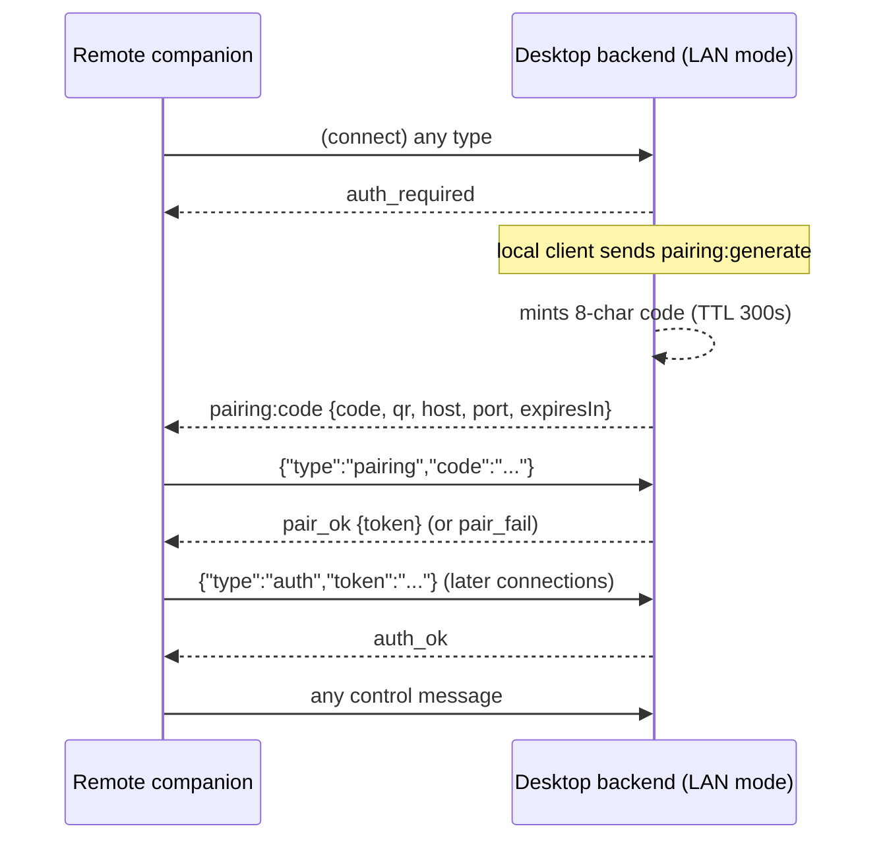

# SyncFlow Wire Protocol Specification

**Status:** descriptive — this document records what the code actually does
(as of v1.1.1), verified against the source and enforced by the
152-check test suite. Constants live in code; where this document and the
code disagree, the code wins and this document is the bug.

Audience: anyone implementing an interoperable client, auditing the
security model, or changing the protocol (changes require updating this
file in the same PR — see §13).

## 1. Overview & roles

SyncFlow is a LAN-only, peer-to-peer file transfer + sync + chat system.
There is no cloud relay (an experimental relay under `backend/relay/` is not
part of the product and not wired to anything).

| Role | Process | Notes |
|---|---|---|
| **Desktop backend** | Python 3 asyncio (`backend/`) | Owns identity, discovery, transfers, trust store. Two listeners: WS control plane + TCP data plane. |
| **Desktop renderer / Companion** | Electron (or Android WebView / browser) | The React UI. Talks JSON to the backend over WebSocket. "Companion mode" is the same renderer over LAN instead of loopback. |
| **Peer** | Another device's desktop backend | Reached over TCP for transfers/chat. |

Trust anchor: each device holds a long-term **Ed25519** keypair
(`signing.key`) and an **X25519** keypair (`x25519.key`), mode 0600 in
`$SYNCFLOW_HOME/identity/` (default `~/.syncflow`). The **device ID** is
`sha256(signing_pub_b64)[:32]` — 32 lowercase hex chars — and is stable for
the lifetime of the identity (`backend/main.py:37`).

## 2. Transports & ports

| Listener | Default port | Env override | Bind |
|---|---|---|---|
| WS control plane | **18973** | `SYNCFLOW_WS_PORT` | `127.0.0.1` by default; `SYNCFLOW_WS_HOST=0.0.0.0` opts into **LAN mode** (`ws_bridge.py:43-45`) |
| TCP data plane | **18974** | `SYNCFLOW_TCP_PORT` | always `0.0.0.0` (`networking/__init__.py:20`) |
| mDNS advertisement | = TCP port | — | advertises the TCP port; TXT records carry `id`, `name`, `mac`, `os`, `port` |

The Electron main process discovers the WS port from the backend's
`SYNCFLOW_PORT:<n>` banner (5 s wait, fallback 18973) and connects to
`ws://127.0.0.1:<port>` (`electron/main.ts:81-117`).

**LAN mode** is the only mode in which remote (non-loopback) clients can
connect, and even then remote clients must complete pairing (§5). Loopback
clients are trusted without a token (`ws_bridge.py:94-97`).

## 3. Framing

### 3.1 WebSocket (control plane)

- Text frames are JSON **objects**; anything else →
  `{"type":"error","error":"invalid JSON" | "message must be an object" |
  "invalid message type"}`.
- Inbound cap `MAX_WS_MESSAGE = 1 MiB`; `ping_interval = ping_timeout = 20 s`
  (`ws_bridge.py:29,68-76`).
- **Binary frames are reserved for file payload** (upload §7, download §8)
  and are routed before JSON parsing. A binary frame arriving while a
  download is pushing → `{"type":"error","error":"unexpected binary frame
  during download"}`.
- Handshake **Origin** allowlist (`ws_bridge.py:18-27`): `null`,
  `http://localhost:5173`, `http://127.0.0.1:5173`, `http://[::1]:5173`,
  `capacitor://localhost`, `http://localhost`, `https://localhost`, or absent
  (non-browser clients). **Origin is not an authentication mechanism** — it
  only narrows which browser pages may open a socket; auth is §5.
- Unknown message `type`: logged, **no reply**. A handler returning `None`
  sends no frame.

### 3.2 TCP (data plane)

Every frame = **4-byte big-endian length prefix + payload**
(`transfer/engine.py:248-286`). Caps:

| Frame class | Cap |
|---|---|
| JSON control | 256 KiB (`MAX_JSON_MSG`) |
| Metadata blob | 256 KiB (`MAX_META_BLOB`) |
| Signed block-header frame | 16 KiB (`MAX_FRAME_BLOB`) |
| Encrypted chunk | `CHUNK_SIZE + 64` = 65 600 B |
| Ack blob | 16 KiB (`MAX_ACK_BLOB`) |

`CHUNK_SIZE = 65536` (64 KiB) for TCP file chunks.
Timeouts on every read: connect 10 s, header 30 s, metadata 30 s,
decision 90 s, stream 120 s (`engine.py:29-33`). Server concurrency:
64 simultaneous connections, waiters dropped after 2 s
(`networking/__init__.py:4-36`).

## 4. Discovery

- mDNS service type **`_syncflow._tcp.local.`**
  (`discovery/mdns.py:10`), instance name `{hostname}-{id[:8]}`, SRV host
  `{instance}.local.`, A record = primary LAN IP, port = TCP port.
- TXT records: `id` (device ID), `name`, `mac`, `os`, `port`. All fields are
  re-validated with strict regexes on receive (`mdns.py:115-157`); TXT data
  is **never trusted** — it only populates the device list. Own
  advertisements are filtered out.
- There is **no subnet scan or port sweep**. Fallback to manual IP entry /
  QR (§5) when mDNS is filtered (e.g. some APs isolate clients).

## 5. Pairing & authentication (WS)

Sequence:



Facts:

- **Code**: 8 chars from RFC 4648 base32 (`A-Z2-7`, 40 bits), single-use,
  TTL **300 s**, compared as `sha256(strip().upper())` in constant time
  (`pairing.py:110-150`). Failure strings: `locked`, `no_code`, `expired`,
  `bad_code` in `{"type":"pair_fail","error":…}`.
- **Lockout**: 5 wrong codes → 300 s lock, code invalidated
  (`pairing.py:135-141`).
- **Token**: `secrets.token_urlsafe(32)` (43 chars). Only `sha256(token)` is
  persisted, in `$SYNCFLOW_HOME/pairing.json` mode 0600. **No expiry.**
  Bad token → bare `{"type":"auth_fail"}`.
- Pre-auth, the *only* accepted JSON types are `pairing` and `auth`; every
  other type (and every binary frame) gets `auth_required`
  (`ws_bridge.py:137-166`).
- **`pairing:generate` is local-only** even after auth: non-loopback senders
  get `{"type":"error","error":"pairing:generate is local-only"}` — a
  remote client can never mint codes.
- `pairing:code` payload: `{type, code, expiresIn, host, port, lanMode, qr}`
  where `qr` is an SVG data-URL over the payload
  `syncflow://pair?host=<ip>&port=<wsport>&code=<code>` — the QR encodes the
  endpoint, never the bearer token.
- Companion clients (Android/web) send `auth` with a saved token on open, or
  `pairing` with a user-entered/QR-scanned code, and queue app messages
  until `auth_ok`/`pair_ok` (queue 500, retry 3 s, handshake timeout 15 s —
  `src/lib/bridge.ts:29-31`).

## 6. Control-plane message catalogue (WS)

### 6.1 Request → reply handlers (`main.py:81-93`)

| Client → backend | Reply | Notes |
|---|---|---|
| `command:send {targetIp, files[], targetPort?, targetDeviceId?, destFolder?, transferId}` | `transfer:new` \| `error` \| `transfer:error` | ≤1000 real paths; host `^[A-Za-z0-9.\-:]{1,64}$`; id `^[A-Za-z0-9_-]{1,64}$` |
| `command:cancel {transferId}` | `transfer:cancelled {transferId, success}` | cancels engine task, staged upload, or companion download |
| `devices:list` | `devices:update {devices}` | mDNS peers minus self |
| `transfers:list` | `transfers:update {active, completed}` | last **20** completed |
| `chat:send {text}` | `chat:ack {messageId, hash}` + broadcast `chat:message`, or `chat:error` | ≤4000 chars, printable + `\n\t` |
| `chat:history` | `chat:history {messages}` | last **100** |
| `identity:get` | `identity:info {signingPub, x25519Pub, deviceId, deviceName}` | |
| `identity:sas {peerDeviceId}` | `identity:sas {peerDeviceId, codes[16], hash}` \| `error "Invalid device id"` | §10.4 |
| `settings:apply {…}` | `settings:applied` \| `error` | Always answered, even for no-ops (never silent); strict field types (`autoAccept` must be a bool, `syncFolders`/`downloadPath` correct shapes → `error`); downloadPath must be `$HOME`-confined; `syncFolders` ≤50, home-confined |
| `peers:list` | `peers:list {peers}` | pins as `{key, name, deviceId, firstSeen, lastSeen}` (`pub` stripped) |
| `peers:forget {key}` | `peers:updated {key, success, peers}` \| `error` | drops a TOFU pin |
| `transfer:approve {transferId, files?}` | `transfer:decision {transferId, approved:true, success}` | resolves pending receiver approval; `files` = **subset approval**: non-empty list of unique non-negative ints (≤1000), else `error "Invalid file selection"`; range vs the declared file count is checked by the engine (out-of-range ⇒ the engine declines) |
| `transfer:decline {transferId}` | `transfer:decision {…approved:false…}` | same handler |

### 6.2 Upload family (`UPLOAD_JSON_TYPES`)

In: `transfer:upload`, `transfer:upload:end`, `transfer:upload:finish`,
`transfer:upload:resume`.
Out: `transfer:upload:ready`, `transfer:upload:file-done`,
`transfer:upload:resume:ready`, `transfer:new`, `error`, plus broadcasts
`transfer:progress`, `transfer:cancelled`.

### 6.3 Download family (`DOWNLOAD_JSON_TYPES`)

In: `transfer:download`, `transfer:download:cancel`.
Out: `transfer:download:ready`, `transfer:download:progress`,
`transfer:download:file-done`, `transfer:download:cancelled`, `error`.

### 6.4 Pre-auth

`pairing` → `pair_ok`/`pair_fail`; `auth` → `auth_ok`/`auth_fail`;
everything else → `auth_required`.

### 6.5 Server pushes

`transfer:progress` (≥0.5 s apart), `transfer:complete {transferId,
error?, verified}`, `transfer:error {transferId, error}`,
`transfer:cancelled`, `chat:message {id, fromDevice, deviceId, text,
timestamp, hash}`, `device:connected {device}` / `device:disconnected
{deviceId}`, `transfer:new` (companion-staged uploads handed to the engine).

> There is no `device:removed` and no `sync:*` family: device lists are
> replaced wholesale by `devices:update` refreshes, and sync folders travel
> in `settings:apply`. Unknown types are ignored by clients per the
> additive-compatibility policy (§13).

## 7. Upload protocol (companion → desktop, over the authed WS)

Binary leg carries raw file bytes; integrity here is **byte-count only**
(cryptographic verification happens on the subsequent TCP hop, §9).

```
transfer:upload {transferId, seq, name, size, batchTotalBytes,
                 targetIp, [targetPort], [targetDeviceId], [destFolder]}
  ←  transfer:upload:ready {transferId, seq, chunkSize:262144, resumeFrom}
  ⟶  <binary frames>  exactly `size` bytes, in order, each ≤ 262144 B
transfer:upload:end {transferId, seq}
  ←  transfer:upload:file-done {transferId, seq}
  … next file: seq+1 …
transfer:upload:finish {transferId}
  ←  transfer:new {transfer:{id,…}}   (engine takes over → TCP path)
```

Session rules (all enforced, `upload.py:322-433`): one active
`transferId` per connection; `seq` must be exactly `next_seq`; first file
must be seq 0; ≤1000 files; target cannot change mid-batch; cumulative
bytes ≤ `batchTotalBytes` ≤ file cap. Oversized frames abort
(`chunk exceeds 262144 bytes`); `end` with a short/long byte count aborts
(`file ended at X of Y bytes`). Staging lives at
`$SYNCFLOW_HOME/staging/<transferId>/<seq>/<name>` (dir 0700), names
sanitized (basename, control chars stripped, leading dots stripped,
Windows reserved names `_`-prefixed, ≤200 chars).

**Resume-after-interrupt:**

- On disconnect, staged bytes stay as an **orphan**: TTL
  `SYNCFLOW_UPLOAD_RESUME_SEC` (default **1800 s**), max **8** orphans
  (LRU), sweeper every 2 s, staging wiped at boot (`upload.py:65-222`).
- `transfer:upload:resume {transferId}` →
  `transfer:upload:resume:ready {transferId, nextSeq,
  partial:{seq,name,size,bytes}|null, resumable}`; staged sizes are
  re-verified on disk before anything is reported.
- A **plain announce** may auto-rejoin only when `seq == next_seq` **and**
  there is no partial file; otherwise an explicit resume handshake is
  required, after which the next announce carries
  `resumeFrom = bytes already staged` and the file opens in append mode.
- A changed file list aborts with `Upload resume mismatch`. `command:cancel`
  and orphan expiry clear staged bytes. Re-announcing the currently-open
  file is idempotent and also returns `resumeFrom`.

Renderer side (`src/lib/upload.ts`): bounded **3** attempts, resume query →
skip completed files → seek `resumeFrom`, 20 s reconnect wait, fail-fast
when the bridge is down, backpressure-aware streaming.

## 8. Download protocol (desktop → companion, over the authed WS)

```
transfer:download {transferId, fileIndex}          # fileIndex 0..999
  ←  transfer:download:ready {transferId, fileIndex, name, size, chunkSize:262144}
  ⟸  <binary frames>   exactly `size` bytes (256 KiB reads)
  ←  transfer:download:progress {…}   (≥0.5 s apart)
  ←  transfer:download:file-done {transferId, fileIndex, received, size, sha256}
transfer:download:cancel {transferId}
  →  transfer:download:cancelled {transferId, success}
```

- `ready` is emitted by the stream task itself, so it provably precedes all
  binary frames for that file.
- The **server computes sha256** over the streamed bytes; the client
  verifies received count against `ready.size` and may verify the hash.
- Paths are resolved **server-side only** from the engine's task/completed
  table — the client never sends a path. One stream per connection *and*
  per `transferId`. The loop yields every 8 chunks (~2 MB) so cancels are
  never starved (`download.py:210-215`).

## 9. TCP transfer protocol (peer ↔ peer)

### 9.1 Handshake

Plaintext, then everything else is encrypted:

1. Initiator → `e2e_offer {signingPub, ephemeralPub, timestamp, signature,
   security:"e2e-blockchain-v1"}`; `signature` = Ed25519 over
   `f"{signingPub}:{ephemeralPub}:{timestamp}"`.
2. Responder **first validates `security`** against its supported suite
   list (`e2e.py: SUPPORTED_SECURITY`) — missing or unknown suite → the
   handshake is refused with `offer missing security suite` /
   `unsupported security suite: …` (ADR-0002 decision 3). Then it verifies
   freshness (`|now − ts| ≤ 300 s`) and the signature **before** deriving
   anything, checks the signer against the TOFU trust store (§10.2), and
   replies `e2e_accept {signingPub, ephemeralPub, signature, peerSigningPub,
   timestamp, status:"accepted", security:"e2e-blockchain-v1"}`.
3. Initiator re-verifies (suite echo → signature → freshness → peer
   identity), both derive keys.

**Suite validation.** The `security` field is not inside the signed
material, so it cannot *steer* suite selection — behaviour is fixed in
code and the only outcome for an unknown/missing token is refusal
(fail-closed, no downgrade path). An `e2e_accept` **without** the field is
still accepted: that is every build ≤ 1.1.1, and additive policy (§13)
requires tolerating an absent new key until the next generation makes it
mandatory.

### 9.2 Key schedule

Ephemeral **X25519** ECDH →
`HKDF-SHA256(salt=b"syncflow-e2e-v1", info=b"transfer-encryption|" +
b"i"/b"r", L=32)` → two directional **AES-256-GCM** keys (`key_send` /
`key_recv`) so each side encrypts with a different key (`e2e.py:112-153`).

Wire blob = `12-byte big-endian monotonic nonce ‖ ciphertext`
(`e2e.py:155-174`).

### 9.3 Flow

1. **Encrypted metadata**: `{kind:"transfer", transferId, senderName,
   files:[{name,size}], destFolder?}`.
2. **Receiver approval** (unless auto-accept): pending future, **60 s**
   timeout → `Timed out waiting for approval`; UI decision arrives as WS
   `transfer:approve`/`transfer:decline`. Encrypted decision frame:
   `{status:"accepted"|"declined", files?, reason?, error?}` — when the
   user picked a subset, `files` lists the accepted meta indexes and
   **both sides narrow to exactly those**: the sender transmits only them,
   the receiver filters its receive plan (task `files`/`totalBytes` narrow,
   `skipped` counts the rest) and completion is checked against the
   accepted byte count.
3. Per file: encrypted `file_meta {name, size}`; then for each 64 KiB
   chunk **two** AEAD blobs — (a) a signed block header
   `{index, prev_hash, chunk_hash, file_name, chunk_size, sender_pubkey,
   timestamp}` with Ed25519 `sig`, hash-chained from
   `GENESIS_HASH = "0"*64`, and (b) the encrypted chunk. The receiver
   verifies index/prev/name/sender/size/hash/signature **per chunk**
   (`blockchain.py:158-199`).
4. Per file: encrypted `file_manifest {transferId, fileName,
   senderPubkey, blockCount, merkleRoot, chainHash}` — binary-tree Merkle
   over block hashes (odd node duplicated). Receiver verifies, writes to
   `name.part-<8hex>` and `os.replace`s **only after full verification**;
   ack `{verified:true, destPath}` or `{verified:false, reason}`.
5. Byte-count match required, then `transfer_complete {verified:true}`.
   Receiver-side ids are local (`in-<16hex>`); the sender's transfer id is
   advisory.

Chat rides the same pipeline as an encrypted `{kind:"chat", text,
fromDevice, ts}` meta, relayed between peers; TCP relay is rate-limited
**30 msgs / 60 s per source IP** (`engine.py:36-37`).

## 10. Crypto profile

### 10.1 Identity

Ed25519 (authenticity) + X25519 (agreement). device ID =
`sha256(signing_pub_b64)[:32]`. Chat ids: `sha256(text + time +
device_id)[:16]`; full message `hash` = 64 hex.

### 10.2 TOFU pinning (`peers.json`, 0600)

Pin key = **receiver-side `ip`**, **sender-side `ip:port`**. Record:
`{pub, name, firstSeen, lastSeen}`. First contact pins; same key updates
`lastSeen`; **different key → hard reject** with
`peer identity for <key> CHANGED (possible MITM) — if the device was
reinstalled, delete <path> to re-pin`. `peers:forget` clears a pin.
`peers:list` deliberately strips `pub` before showing it to the UI.

### 10.3 What is encrypted where

| Path | Protection |
|---|---|
| WS LAN mode | Token auth (§5) + pairing codes; **no TLS** — traffic on the LAN is readable by a LAN attacker *unless* it is also an E2E peer; app-level secrets ride the TCP path |
| TCP transfers/chat | Full E2E: authenticated handshake, metadata + decision + chunks + manifest + acks all AEAD-encrypted, per-chunk signature chain, per-file Merkle |
| mDNS TXT | Public by design (discovery), never trusted |
| QR payload | Endpoint + code only — never tokens or keys |

### 10.4 SAS (out-of-band verification)

`backend/sas.py`: `combined = "".join(sorted([id_a, id_b]))` (order
independent), `digest = sha256(combined)`, first **12 bytes (96 bits)** →
16 × 6-bit codes (0..63); the UI maps codes → 16 icons from an append-only
shared alphabet (`src/lib/sas.ts`). The full 32-byte digest is also
returned as `hash` for hex comparison. Inputs must match `^[0-9a-f]{32}$`
and differ.

Because both IDs are SHA-256 hashes of signing keys already exchanged at
pairing, matching icons prove both ends bound the *same* key pair —
defeating a pairing-time MITM. **The algorithm is frozen: changing it
requires a protocol version bump (§13).**

## 11. Error frames

Shapes:

| Shape | Produced by |
|---|---|
| `{"type":"error","error":"<≤200 printable chars>"}` | validation everywhere; often carries `transferId` too |
| `{"type":"pair_fail","error":"locked\|no_code\|expired\|bad_code"}` | pairing |
| `{"type":"auth_fail"}` *(no error field)* | bad token |
| `{"type":"auth_required","error":"pairing required: …"}` | pre-auth gate |
| `{"type":"chat:error","error":"Invalid message\|Empty message"}` | chat validation |
| `{"type":"transfer:error","transferId","error",["verified"]}` | engine/transfer failures |

**Casing rule (error vocabulary).** Every static string carried in an
`"error"` field is sentence-cased (first character upper-case). The single
lower-case-prefixed literals are directives that name a message type
(`pairing:generate is local-only`, the `pairing required: …` gate) — they
read as instructions, not sentences. Diagnostic reasons that originate as
exceptions are sentence-cased when they reach the UI (`engine.sentence`,
`ws_bridge._sentence`). `t_proto` D1 pins the casing; D2 pins this
catalogue against the source — **a new static error string must be added
to this list in the same PR.**

**Static catalogue** (machine-checked — every static `"error": "…"` literal
in `backend/**/*.py` must appear below):

`{"type":"error"}` request-validation and state errors:

- `Download already in progress`
- `Download path must be inside your home directory`
- `Files exceed announced batch size`
- `First file must start at sequence 0`
- `Invalid JSON`
- `Invalid auto accept value`
- `Invalid batch size`
- `Invalid destination folder`
- `Invalid device id`
- `Invalid device name`
- `Invalid download path`
- `Invalid file index`
- `Invalid file list`
- `Invalid file selection`
- `Invalid file sequence`
- `Invalid file size`
- `Invalid max concurrent value`
- `Invalid message type`
- `Invalid peer key`
- `Invalid sync folders`
- `Invalid target address`
- `Invalid target device id`
- `Invalid target port`
- `Invalid transfer id`
- `Message must be an object`
- `Missing file name`
- `Missing target IP or files`
- `No active upload`
- `No files were uploaded`
- `None of the selected files exist on disk`
- `Out-of-sequence file`
- `Rate limited`
- `Target changed mid-upload`
- `Too many files in one upload`
- `Transfer declined by receiver`
- `Transfer id already staging`
- `Transfer is already being downloaded`
- `Unexpected binary frame during download`
- `Upload already in progress`
- `Upload busy`
- `Upload resume mismatch`
- `pairing:generate is local-only`

`{"type":"chat:error"}`:

- `Empty message`
- `Invalid message`

`{"type":"auth_required"}` directive:

- `pairing required: send pairing:generate from the desktop, then pairing/auth`

**Dynamic reasons** (f-strings / exception text — not machine-checked, but
always sentence-cased at the boundary): `File exceeds N MB upload cap`,
`Cannot stage upload: …`, `Cannot stage file: …`, `Invalid download path:
…`, `Timed out waiting for approval`, `Connection lost`, `Cancelled`,
`Connection timed out`, `Transfer rejected`, `E2E handshake failed —
identity mismatch or MITM detected`, integrity chain (`chunk hash mismatch
— data tampered`, `chain broken — prev_hash mismatch`, `merkle root
mismatch`), and peer-pin reasons from the trust store (e.g. `peer identity
for <key> CHANGED (possible MITM) …`).

TCP-side integrity failures surface to the UI through `transfer:error`;
they are never downgraded to warnings.

## 12. Safety limits

| Limit | Value | Env override |
|---|---|---|
| Files per send / per upload | 1000 | — |
| Upload file cap | 8192 MB | `SYNCFLOW_MAX_UPLOAD_MB` |
| Upload chunk | 256 KiB | — |
| Upload orphan TTL / count | 1800 s / 8 (LRU) | `SYNCFLOW_UPLOAD_RESUME_SEC` |
| Download chunk / index cap | 256 KiB / fileIndex ≤ 999 | — |
| Chat message / history / returned | 4000 chars / 500 stored / 100 served | — |
| Chat TCP rate (per IP) | 30 per 60 s | — |
| WS frame | 1 MiB | — |
| TCP frame classes | 256 KiB / 16 KiB / 65 600 B / 16 KiB | — |
| Handshake freshness | 300 s | — |
| Approval timeout | 60 s | — |
| Outbound concurrency | 4 (clamp 1–8) | config `max_concurrent` |
| TCP connections | 64 (wait 2 s) | — |
| Pairing code | 8×base32, TTL 300 s, single-use, 5 fails → 300 s lock | — |
| Sync folders / dest folder | ≤50 entries / ≤64 chars, `$HOME`-confined | — |
| Completed transfers kept | 20 | — |

**Complete env-var set:** `SYNCFLOW_WS_PORT`, `SYNCFLOW_TCP_PORT`,
`SYNCFLOW_WS_HOST`, `SYNCFLOW_HOME`, `SYNCFLOW_MAX_UPLOAD_MB`,
`SYNCFLOW_UPLOAD_RESUME_SEC` (+ test-only `SYNCFLOW_SMOKE_FROZEN`).

## 13. Versioning & compatibility policy

Current state, honestly:

- **There is no version field on WS or TCP messages.** The only
  version-ish token is `security:"e2e-blockchain-v1"` in the offer, and the
  receiver does not validate it today.
- Renderer and backend do not exchange versions; unknown message types are
  ignored by clients (forward compatibility by omission).
- Frozen-for-now: the SAS derivation (§10.4), the pairing code charset and
  TTL semantics, the E2E key schedule, and all framing caps above.

Policy going forward (decision record: [ADR-0002](adr/0002-frozen-sas-and-versioning.md);
`security` validation is now enforced in code — §9.1, pinned by `t_crypto`
C7a–C7c):

1. **Additive fields only** within a protocol generation — receivers must
   ignore unknown JSON keys and unknown `type`s.
2. Any change to framing, key schedule, SAS, or trust semantics = **new
   generation**, advertised in the `e2e_offer.security` string **and**
   validated by the receiver before any other field is read (unknown or
   missing suite → refuse).
3. This document must be updated in the same PR as any such change; the
   test suite must gain a check that pins the new behaviour.

## 14. Security considerations (read before trusting this)

- **No TLS on the WS control plane.** In LAN mode, control frames are
  readable (and the pairing code is briefly sniffable) by anyone on the
  same L2 segment. Mitigations: codes are single-use/40-bit/5-min,
  tokens are 256-bit, file contents and chat are E2E-encrypted on the TCP
  path, and the WS bind is loopback unless explicitly opted into.
- **Loopback = trusted.** Anything able to open `127.0.0.1:18973` is treated
  as the local user. That is the same assumption every local daemon makes.
- **Origin checks are not auth** — they only stop drive-by browser pages.
- **TOFU is TOFU.** First contact is unauthenticated; the SAS ritual (§10.4)
  is the out-of-band defence against a first-contact MITM, and the
  key-changed hard reject defends against later substitution. Neither helps
  if you never verify.
- **No transport security for discovery** — mDNS is spoofable by design;
  discovered devices are untrusted until a transfer handshake + pin says
  otherwise.
- Reported vulnerabilities: see [SECURITY.md](../SECURITY.md). Test evidence:
  [security-audit.md](security-audit.md) (152 checks).

---

*Protocol reference: `backend/ws_bridge.py`, `backend/main.py`,
`backend/upload.py`, `backend/download.py`, `backend/pairing.py`,
`backend/transfer/engine.py`, `backend/crypto/{e2e,blockchain}.py`,
`backend/sas.py`, `backend/discovery/mdns.py`.*
